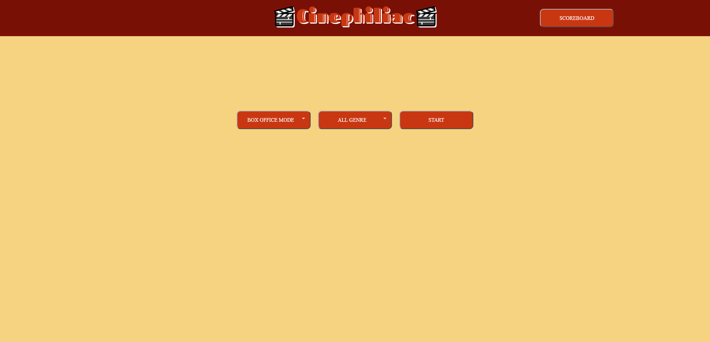

# Cinephiliac
A frustratingly addictive game of higher or lower using movies statistics.

## Description

Provide a short description explaining the what, why, and how of your project. Use the following questions as a guide:

- What was your motivation?
- Why did you build this project? (Note: the answer is not "Because it was a homework assignment.")
- What problem does it solve?
- What did you learn?

## Installation

N/A

## Usage

Visit the website https://nicolasflamel.github.io/Cinephiliac/ to see the working project.

To add a screenshot, create an `assets/images` folder in your repository and upload your screenshot to it. Then, using the relative file path, add it to your README using the following syntax:

## Credits

Amauri Rodriguez - https://github.com/NicolasFlamel

Jordan Ferrario - https://github.com/JordanFerrario

Veroneca Sanders - https://github.com/Vtsander

Tazlina Shake - https://github.com/Tshake5

## License

N/A